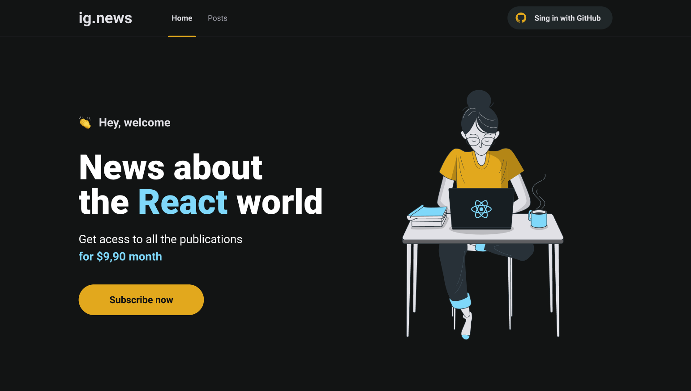
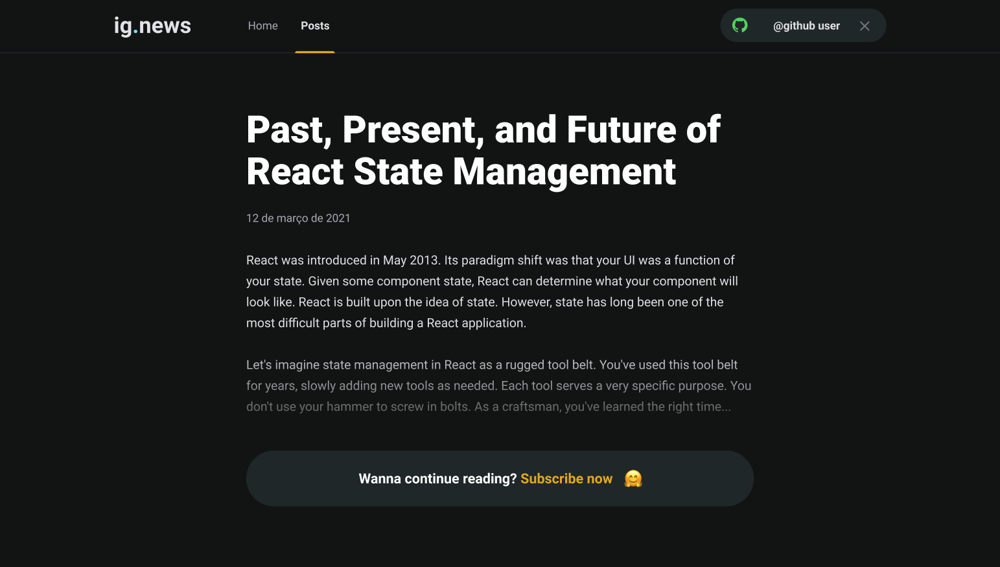

<div id="top" align="center">
  <div>
    
  </div>
  <h4 align="center">ig.news | News about the React world.</h4>
</div>

## Resumo

  <ol>
    <li><a href="#visão-geral-do-projeto">Visão geral do projeto</a></li>
    <li><a href="#sobre-o-projeto">Sobre o projeto</a></li>
    <li><a href="#tecnologias-utilizadas">Tecnologias utilizadas</a></li>
    <li><a href="#instalação-e-utilização">Instalação e utilização</a></li>
    <li><a href="#licença">Licença</a></li>
    <li><a href="#agradecimentos">Agradecimentos</a></li>
  </ol>

## Visão geral do projeto

<div>
  <h3 >
    
    <a href="https://www.figma.com/file/gl0fHkQgvaUfXNjuwGtDDs/ig.news?node-id=1%3A2">Layout no Figma</a>
  </h3>
</div>

<div align="center">
    
    
</div>

## Sobre o projeto

O ig.news é uma página de noticias sobre o universo React. Os usuários poderão realizar a assinatura dos conteúdos por apenas $9.90 ao mês. Antes de realizar uma assinatura na aplicação, o usuário deverá se cadastrar através do login com github. Logo após, será possível assinar os conteúdos, onde o pagamento é feito através de cartão de crédito pela plataforma do Stripe.

Caso o usuário não tenha uma assinatura de conteúdo na aplicação, ele ainda poderá ter acesso a listagem de postes, podendo fazer uma breve leitura dos postes de seu interesse, como mostrado na imagem acima.

## Tecnologias utilizadas

As principais tecnologias utilizadas na construção deste projeto foram: 

* [Next.js](https://nextjs.org/)
* [Fauna Data API](https://fauna.com/)
* [Stripe Payments](https://stripe.com/en-br)
* [Prismic CMS](https://prismic.io/)
* [Sass CSS](https://sass-lang.com/)
* [Axios HTTP Client](https://axios-http.com/docs/intro)

## Instalação e utilização

Instruções de instalação do projeto em seu computador.

### Pré-requisitos

Clone este repositório utilizando o comando a seguir. Lembre-se, você deve possuir a CLI do git instalada em seu computador.

```sh
git clone https://github.com/ivanvinicius/ignews.git
```
Para que seja possível fazer o download das depêdencias do projeto, recomendamos a utilização de um package mananger:

* [Yarn (Recomendado para este projeto)](https://classic.yarnpkg.com/lang/en/docs/install/#debian-stable)
* [Npm](https://nodejs.org/en/)
  
### Instalação

1. Dentro da pasta do projeto, rode o comando ```yarn``` para fazendo o download da depêndencias.

2. Na raiz do projeto crie o arquivo ```env.local```, onde ficarão as variáveis ambiente da aplicação. Então copie todo o conteúdo do arquivo ```env.example```.

3. Preencha os valores das variáveis ambiente com os dados que você criou nos serviços on-line. São eles:

* [Stripe](https://dashboard.stripe.com/)
* [Github](https://github.com)
* [Fauna](https://fauna.com/)
* [Prismic](https://prismic.io/)

4. Através da CLI do Stripe é possível ouvir os Webhooks, com os eventos das sessões. Rode o comando abaixo para ouvir os eventos.
  
```sh
stripe listen --forward-to localhost:3000/api/webhooks
``` 

5. Rode o comando ```yarn dev``` para executar o projeto em seu localhost:3000.

## Licença

 O projeto ainda não contém nenhuma licença. ⚠️

## Agradecimentos

* [Rocketseat Education - Boosting People.](https://www.rocketseat.com.br/)
* [Diego Fernandes - Github Profile.](https://github.com/diego3g/)

<br/>
<h4 align="center"><a href="#top">Voltar ao Início</a></h4>

<p align="right">"Estabilidade não existe" - Flavio Augusto</p>
